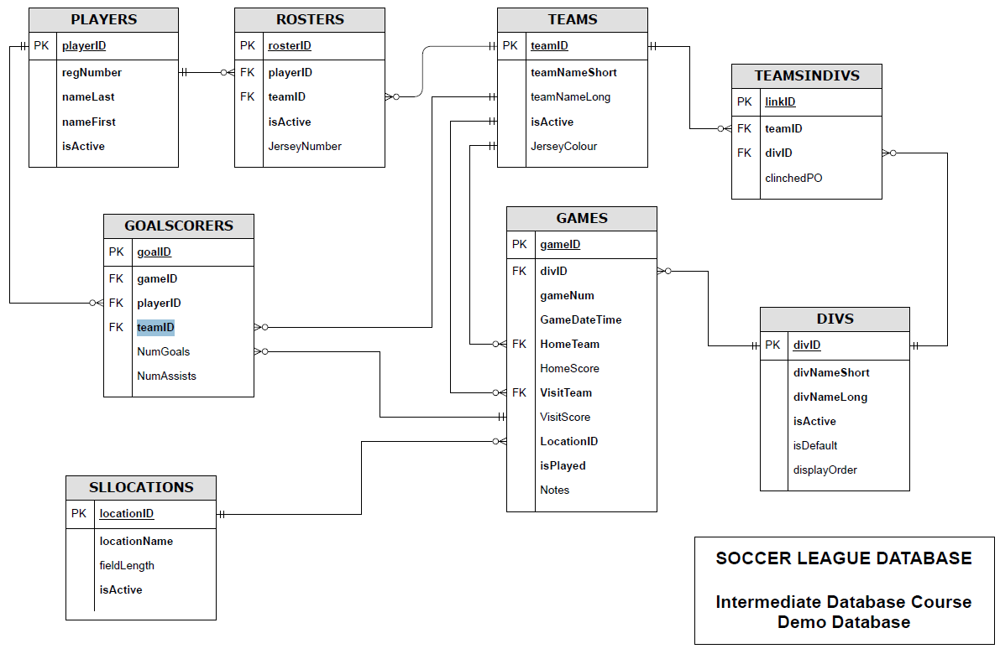

### Database Enhancement

#### Project Overview

This project focuses on enhancing the SportLeagues database by developing various PL/SQL objects. These enhancements aim to facilitate basic CRUD operations and other functionalities within the database. This is a group undertaking completed in collaboration with Siripa Purinruk and Huu Linh Nguyen.

Here is an ERD about the database on which we will create enhancements:

#### File Description

- `Scripts/DocumentEnhancements.sql`: Contains the PL/SQL code developed for the project.

### Skills Gained

#### Technical Skills

1. **PL/SQL Programming**: Mastery in writing, debugging, and optimizing PL/SQL code.
2. **CRUD Operations**: In-depth knowledge of implementing Create, Read, Update, and Delete operations in a database context.
3. **Error Handling**: Proficiency in managing SQL exceptions using error codes for more robust database operations.
4. **Database Design**: Enhanced understanding of database structures and relationships, particularly in sports league management systems.

#### Analytical and Problem-Solving Skills

1. **Problem Solving**: Developed a strong ability to tackle complex challenges encountered in database programming and design.
2. **Analytical Thinking**: Advanced skills in analyzing requirements and implementing efficient database solutions.

### Experience Gained

#### Practical Experience

1. **Stored Procedures Creation**: Hands-on experience in designing and implementing Stored Procedures for a range of database functionalities.
2. **Data Retrieval Techniques**: Experience in advanced data retrieval methods, including returning table data as part of Stored Procedure outputs.
3. **Views and Functions Development**: Practical skills in creating and using views and user-defined functions to enhance data accessibility and manipulation in the database.

#### Collaborative Experience

1. **Teamwork**: Valuable experience gained in working collaboratively within a group, contributing effectively to a complex database project.
2. **Project Management**: Experience in managing different aspects of a database project, from initial design to implementation and testing.

### Contents

1. **CRUD Stored Procedures**:

   - Implementation of Stored Procedures for `INSERT`, `UPDATE`, `DELETE`, and `SELECT` operations on the `Players`, `Teams`, and `Rosters` tables. Each SP is designed to handle specific CRUD operations, with appropriate error handling and return values.

2. **Display Content Stored Procedures**:

   - Stored Procedures named `spTableNameSelectAll` for displaying all records from `Players`, `Teams`, and `Rosters` tables using `DBMS_OUTPUT`.

3. **Advanced Data Retrieval Procedures**:

   - Stored Procedures returning table data as part of their output (`spPlayersSelectTable`, `spTeamsSelectTable`, `spRostersSelectTable`), demonstrating advanced data retrieval techniques.

4. **View for Player Rosters**:

   - A view named `vwPlayerRosters` combining data from `Players`, `Rosters`, and `Teams`.

5. **Team Roster Stored Procedures**:

   - `spTeamRosterByID` and `spTeamRosterByName` for displaying team rosters based on ID and name.

6. **Player Count View**:

   - A view `vwTeamsNumPlayers` showing the number of players registered on each team.

7. **Player Count Function**:

   - A function `fncNumPlayersByTeamID` to return player counts based on team ID.

8. **Game Schedule View**:

   - `vwSchedule` for displaying detailed game schedules.

9. **Game Schedule Stored Procedures**:

   - `spSchedUpcomingGames` and `spSchedPastGames` for showing upcoming and past games.

10. **Standings Calculation**:

    - `spRunStandings` for updating standings in a temporary table.

11. **Standings Update Trigger**:

    - A trigger to automate the execution of `spRunStandings`.

12. **Additional Custom Database Object**:
    - A unique database object developed by the group to enhance the database's functionality.

For detailed information about the PL/SQL objects, including required input parameters, expected outputs, potential error codes, purpose, and example code, please refer to the [User Guide](./Documentation/UserGuide.pdf).

#### Error Codes

- The project uses specific error codes for exception handling across different Stored Procedures. These codes include:
  - `-1`: No data found
  - `-2`: Many rows returned
  - `-3`: No row inserted/updated/deleted
  - `-4`: VALUE_ERROR
  - `-5`: Others
  - `-6`: Invalid cursor

#### Notes

- Ensure `SERVEROUTPUT` is set ON for proper execution of `DBMS_OUTPUT`.
- Please refer to inline comments within the `.sql` file for detailed implementation notes and guidelines.
